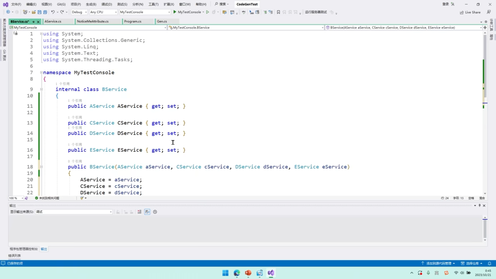
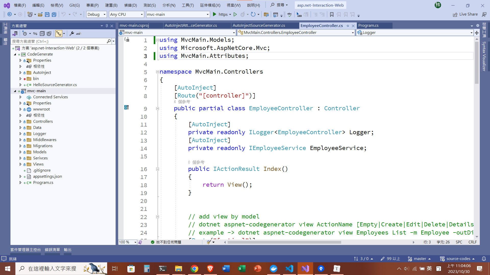

#  互動網頁程式設計

乳題，這門課的作業與實驗，主要講的是`asp.net core mvc`，不是`asp.net mvc`實在是令人驚訝，印象中學校這種教授做完ppt就可以用到退休的地方會與時俱進的那麼快呢XD

- 20231029
  - 最近發現了一個很有趣的東西，Roslyn Source Generator，這次以生成DI會寫的那一大坨Constructor來練習
    
    
圖1. 一大坨Constructor之示意圖

  
     
  
    
    
圖2. 使用AutoInject

  - 參考
    - https://blog.miniasp.com/post/2020/11/30/Introducing-Roslyn-Source-Generators
    - https://www.bilibili.com/video/BV1pQ4y1p7bV

- 20231120
  - 實現在publish的時候自動生成對應的壓縮檔，以因應老師將採取的作業繳交方式：將寫好的程式publish生出來的檔案壓縮後傳到老師開的伺服器上面