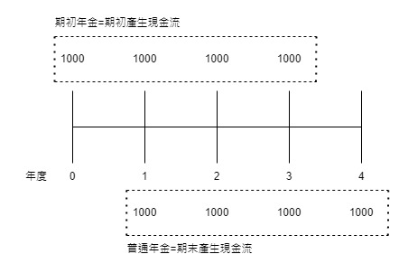

# 貨幣的時間價值

## 摘要與公式

1. 終值(Future Value，FV): 指今天投資的一筆錢，隨著時間的流逝，在一定的利率複利計算下會變成多少錢。

```math
\begin{aligned}
	FV_n&=PV_0*FVIF(k\%,n)\\&=PV_0*(1+k\%)^n
\end{aligned}
```

2. 現值(Present Value，PV): 是指未來的貨幣在今日的價值，也就是說未來一筆金額，
經過一段時間 折現(Discount)後，算出的現在貨幣價值，簡單來說就是未來的1元等於今天多少錢。

```math
\begin{aligned}
	PV_n&=FV_n*PVIF(k\%,n)\\&=\frac{FV_n}{(1+k\%)^n}
\end{aligned}
```

3. 年金(Annuity)：每隔相同的時間，收到或付出一筆固定金額的錢。
   1. 年金每期的收入或支付金額固定不變。
   2. 年金的計算期間內，每期現金流量必須持續不能中斷。
   3. 例: 零存整付、房屋貸款、年金給付…等。
   4. 普通年金(ordinary annuity)與期初年金(annuity due)
      1. 若定期支出、收入發生於每期的期末，稱為普通年金
      2. 若定期支出、收入發生於期初(第0期)，稱為期初年金。
      3. 期初年金相較普通年金多一次複利
      
   5. 年金的終值與現值
      1. 現值
         - 普通年金現值
```math 
\begin{aligned}
	PVOA_n&=PMT*PVIFA(k\%,n) \\
	      &=PMT*\frac{1-\frac{1}{(1+k\%)^n}}{k\%}\\
	      &=PMT*\Sigma_{x=1}^{n}\frac{1}{(1+k\%)^{x}}
\end{aligned}
```
		  - 期初年金現值: 把普通年金現值多複利一次即得期初年金現值
```math
PVAD_n=PVOA_n*(1+k\%)
```
      2. 終值
	     - 普通年金終值
```math 
\begin{aligned}
	FVOA_n&=PMT*FVIFA(k\%,n) \\
	      &=PMT*\frac{(1+k\%)^n-1}{k\%}\\
	      &=PMT*\Sigma_{x=1}^{n}(1+k\%)^{n-x}
\end{aligned}
```
		  - 期初年金終值: 把普通年金終值多複利一次即得期初年金終值
```math
FVAD_n=FVOA_n*(1+k\%)
```
	6. 永續年金(Perpetuity)
		 - 沒有到期日的年金 $\rightarrow$ 沒有終值問題
		 - 現值求算
    		 - 普通永續年金現值
```math
PV=\frac{PMT}{k\%}
```
            - 期初永續年金現值
```math
PV=\frac{PMT}{k\%}*(1+k\%)
```

## 習題
1. 大華證券經紀部為了鼓勵投資人開戶，正在規劃現金抽獎活動，總經理特別助 小程想比較下列各種方案，您能不能告訴他哪個方案最有價值(設折現率=12%)?
(1) 現金10萬元
(2) 5 年後支付 18 萬元
(3) 每年支付11400元，直到永遠
(4) 從明年開始支付6500元，每年支付額增加5%，直到永遠
	- Ans
```math
\begin{aligned}
	PV_1&=100000 \\
	PV_2&=180000*\frac{1}{(1+12\%)^{5}} \\
        &=102316 \\
	PV_3&=\frac{11400}{12\%}=95000 \\
	PV_4&=92857 \\
\end{aligned}
```
   	$\therefore$ 由上面的計算可知，方案(2)最有價值一其有最大現值
2. 台灣職棒大聯盟當紅投手小陳的球隊提供他年薪 300 萬元的5年契約；另一個有意挖角的球隊則供總額1400萬元的契約，但支付的方式為馬上支付400萬元，往後5年每年付200萬元。您覺得哪個契約的條件較優渥?(假設利率為10%)
   - Ans
	目前球隊薪水現值為：
```math
\begin{aligned}
	PV&=3000000*PVIFA(10\%, 5) \\
	&=11373000
\end{aligned}
```
	有意挖角球隊薪水現值為：
```math
\begin{aligned}
	PV&=4000000＋2000000*PVIFA(10\%, 5)\\
	&=11582000
\end{aligned}
```
   	$\therefore$ 由上列的比較可知有意挖角球隊的薪水較優渥。
3. 林先生向政大銀行貸款購屋，其貸款年限為10年，林先生從今年起每年年底必須償還銀行20萬元；由於林先生最近財務狀況欠佳，擬延長貸款年限為15年，假設貸款年利率均為10%，則在新的還款年限下，林先生每年年底應償還的金額為多少？
	- Ans
	假設每年應償還$PMT$，貸款金額$P$
```math
\begin{aligned}
	P&=200000*PVIFA(10\%,10) \\
	 &=200000*\Sigma_{x=1}^{10}\frac{1}{(1+10\%)^x} \\
	 &\approx 1228920
\end{aligned}
```
	得到貸款金額$P=1228920$，在新的年限下，計算新的每期應付額
```math
\begin{aligned}
 	1228920&=PMT*PVIFA(10\%,15) \\
 	       &=PMT*\Sigma_{x=1}^{15}\frac{1}{(1+10\%)^x} \\
 	   PMT &\approx 161570
\end{aligned}
```
	$\therefore$ 在新的還款年限下，林先生每年年底應償還的金額為161570元